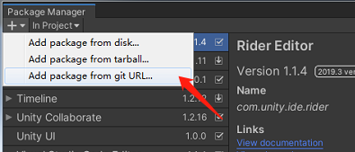
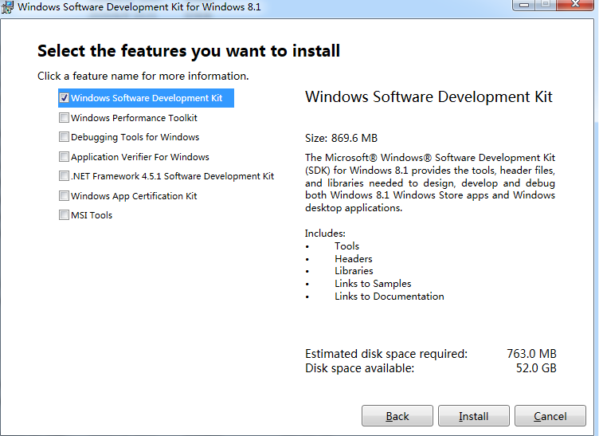

# Loxodon Framework Connection

 

*Developed by Clark*

Requires Unity 2018.4 or higher.

This is a network connection component, implemented using TcpClient, supports IPV6 and IPV4, automatically recognizes the current network when connecting with a domain name, and preferentially connects to the IPV4 network.

## Installation

### Install via OpenUPM (recommended)

[OpenUPM](https://openupm.com/) can automatically manage dependencies, it is recommended to use it to install the framework.

Requires [nodejs](https://nodejs.org/en/download/)'s npm and openupm-cli, if not installed please install them first.

    # Install openupm-cli,please ignore if it is already installed.
    npm install -g openupm-cli

    #Go to the root directory of your project
    cd F:/workspace/New Unity Project

    #Install loxodon-framework-connection
    openupm add com.vovgou.loxodon-framework-connection

### Install via Packages/manifest.json

Modify the Packages/manifest.json file in your project, add the third-party repository "package.openupm.com"'s configuration and add "com.vovgou.loxodon-framework-connection" in the "dependencies" node.

Installing the framework in this way does not require nodejs and openm-cli.

    {
      "dependencies": {
        ...
        "com.unity.modules.xr": "1.0.0",
        "com.vovgou.loxodon-framework-connection": "2.0.0"
      },
      "scopedRegistries": [
        {
          "name": "package.openupm.com",
          "url": "https://package.openupm.com",
          "scopes": [
            "com.vovgou",
            "com.openupm"
          ]
        }
      ]
    }

### Install via git URL

After Unity 2019.3.4f1 that support path query parameter of git package. You can add https://github.com/vovgou/loxodon-framework.git?path=Loxodon.Framework/Assets/LoxodonFramework to Package Manager

- Loxodon.Framework.Connection: https://github.com/vovgou/loxodon-framework.git?path=Loxodon.Framework.Connection/Assets/LoxodonFramework/Connection

### Install via *.unitypackage file

Download Loxodon.Framework.Connection.unitypackage, import them into your project.

- [Releases](https://github.com/vovgou/loxodon-framework/releases)

## Quick Start

    IConnector<Request, Response, Notification> connector;
    ISubscription<EventArgs> eventSubscription;
    ISubscription<Notification> messageSubscription;
    async void Start()
    {
        //Create TcpChannel
        var channel = new TcpChannel(new DefaultDecoder(), new DefaultEncoder(), new HandshakeHandler());
        channel.NoDelay = true;
        channel.IsBigEndian = true;

        //TLS encryption is optional
        channel.Secure(true, "vovgou.com", null, (sender, certificate, chain, sslPolicyErrors) =>
        {
            //Verify self-signed certificates
            if (sslPolicyErrors == SslPolicyErrors.None)
                return true;

            if (certificate != null && certificate.GetCertHashString() == "3C33D870E7826E9E83B4476D6A6122E497A6D282")
                return true;

            return false;
        });

        //Create Connector
        connector = new DefaultConnector<Request, Response, Notification>(channel);
        connector.AutoReconnect = true;

        //Subscribe to events
        eventSubscription = connector.Events().ObserveOn(SynchronizationContext.Current).Subscribe((e) =>
        {
            Debug.LogFormat("Received Event:{0}", e);
        });

        //Subscribe to notification messages
        messageSubscription = connector.Received().Filter(message =>
        {
            //Filter messages
            if (message.CommandID > 0 && message.CommandID <= 100)
                return true;
            return false;
        }).ObserveOn(SynchronizationContext.Current).Subscribe(message =>
        {
            Debug.LogFormat("Received Notification:{0}", message);
        });

        //Send a notification message
        Notification notification = new Notification();
        notification.CommandID = 10;
        notification.ContentType = 0;
        notification.Content = Encoding.UTF8.GetBytes("this is a notification.");
        await connector.Send(notification);

        //Send a request message and receive a response message.
        Request request = new Request();
        request.CommandID = 20;
        request.ContentType = 0;
        request.Content = Encoding.UTF8.GetBytes("this is a request.");
        Response response = await connector.Send(request);
    }
    
## How to create a self signed certificate

- Download Makecert.exe from [here](https://developer.microsoft.com/en-us/windows/downloads/sdk-archive/)
   
  
  
- Install Window 8.1 SDK

  
  
- Add "C:\Program Files (x86)\Windows Kits\8.0\bin\x64" to the operating system environment variable PATH

- Creating self signed certificates

      makecert -r -pe -n "CN=vovgou.com" -b 01/01/2020 -e 01/01/2120 -sky exchange -a sha256 -len 2048 -sv vovgou.pvk  vovgou.cer
  
      pvk2pfx.exe -pvk vovgou.pvk -spc vovgou.cer -pfx vovgou.pfx

- Use self-signed certificates

      TextAsset textAsset = Resources.Load<TextAsset>("vovgou.pfx");
      X509Certificate2 cert = new X509Certificate2(textAsset.bytes, "123456");
      
      var server = new Server(port);
      server.Secure(true, cert, (sender, certificate, chain, sslPolicyErrors) =>
      {
         //The server does not verify the client's certificate and returns true
         return true;
      });

For the complete makecert.exe parameter reference [click here](http://msdn.microsoft.com/en-us/library/bfsktky3%28v=vs.110%29.aspx)

## Contact Us
Email: [yangpc.china@gmail.com](mailto:yangpc.china@gmail.com)   
Website: [https://vovgou.github.io/loxodon-framework/](https://vovgou.github.io/loxodon-framework/)  
QQ Group: 622321589 
