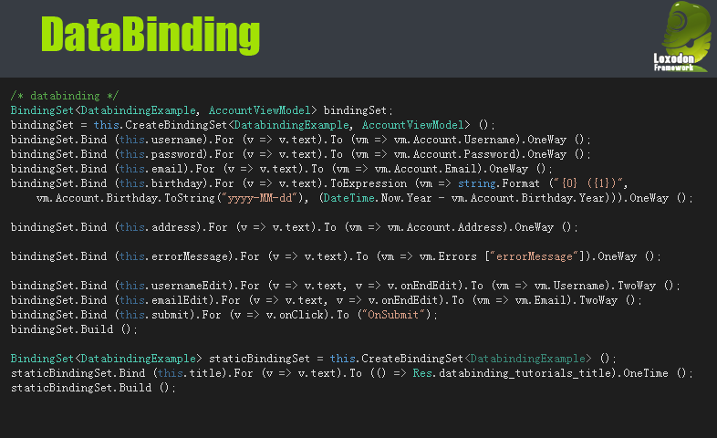

# Loxodon Framework

[(English)](README.md)

**MVVM Framework for Unity3D （C# & XLua）**

*开发者 Clark*

要求Unity 5.6.0或者更高版本

LoxodonFramework是一个轻量级的MVVM(Model-View-ViewModel)框架，它是专门为Unity3D游戏开发设计的，参考了WPF和Android的MVVM设计，它提供了视图和视图模型的数据绑定、本地化、一个简单的对象容器、配置文件组件、线程工具组件、应用上下文和玩家上下文，异步线程和协程的任务组件等基本组件，同时还提供了一个UI视图的框架。所有代码都基于面向对象面向接口的思路设计，几乎所有功能都可以自定义。而且在数据绑定部分进行了性能优化，在支持JIT的平台上使用的是委托的方式绑定，在不支持JIT的平台，默认使用的是反射，但是可以通过注入委托函数的方式来优化！

本框架使用C#语言开发，同时也支持使用XLua来开发，XLua插件是一个可选项，如果项目需要热更新，那么只要安装了XLua插件，则可以完全使用Lua来开发游戏。

这个插件兼容 MacOSX,Windows,Linux,UWP,IOS and Android等等，并且完全开源。

**已测试的平台：**  
PC/Mac/Linux  
IOS  
Android  
UWP(window10)

## 中文文档

- [HTML](https://github.com/cocowolf/loxodon-framework/blob/master/docs/LoxodonFramework.md)
- [PDF](https://github.com/cocowolf/loxodon-framework/blob/master/docs/LoxodonFramework.pdf)
- [常见问题解答 FAQ](https://github.com/cocowolf/loxodon-framework/blob/master/docs/faq.md)

## 下载  
- [AssetStore](https://www.assetstore.unity3d.com/#!/content/77446)
- [Releases](https://github.com/cocowolf/loxodon-framework/releases)

## 关键功能：
- MVVM框架;
- 支持XLua，可以完全使用Lua脚本开发（可选）
- 多平台支持;
- 高扩展性，面向接口开发;
- 支持线程和协程的异步结果和异步任务，采用Future/Promise设计模式;
- 多线程组件和定时执行器; 
- 支持消息系统，订阅和发布事件;
- 可加密的配置文件，支持对象存取，可以自定义对象转换器，支持更多的对象;
- 本地化支持，支持xml、csv、asset等多种配置方式，支持图片等多媒体资源本地化;
- 数据绑定支持:
    - Field绑定，只支持OneTime的模式，因无法支持改变通知;
    - 属性绑定，支持TwoWay双向绑定，值修改自动通知;
    - 普通字典、列表绑定，不支持改变通知;
    - 支持C#事件绑定;
    - 支持Unity3D的EventBase事件绑定;
    - 支持静态类的属性和Field的绑定;
    - 支持方法绑定;
    - 支持命令绑定，通过命令绑定可以方便控制按钮的有效无效状态;
    - 支持可观察属性、字典、列表的绑定，支持改变通知，视图模型修改自动更改UI显示;
    - 支持表达式的绑定;
    - 支持类型转换器，可以将图片名称转换为图集中的Sprite
    
## 注意：  
- LoxodonFramework 支持 .Net2.0 和 .Net2.0 Subset  
- LoxodonFramework 支持 .Net4.x 和 .Net Standard2.0  
- LoxodonFramework 支持 Mono2x 和 IL2CPP  
- IOS平台需要配置 AOT Compilation Options: "nrgctx-trampolines=8192,nimt-trampolines=8192,ntrampolines=8192"   
    
    现在这个配置不是必要的，在早期的Unity3D版本，在IOS平台上，不配置它们可能导致游戏崩溃。
    
     
     
## 快速开始

创建一个进度条的视图和视图模型，并将视图中的UI控件和视图模型绑定，修改视图模型ProgressBarViewModel中的属性，视图UI界面将会自动改变。

    public class ProgressBarViewModel : ViewModelBase
    {
        private string tip;
        private bool enabled;
        private float value;
        public ProgressBarViewModel()
        {
        }

        public string Tip
        {
            get { return this.tip; }
            set { this.Set<string>(ref this.tip, value, nameof(Tip)); }
        }

        public bool Enabled
        {
            get { return this.enabled; }
            set { this.Set<bool>(ref this.enabled, value, nameof(Enabled)); }
        }

        public float Value
        {
            get { return this.value; }
            set { this.Set<float>(ref this.value, value, nameof(Value)); }
        }
    }
	
	public class ProgressBarView : UIView
    {
        public GameObject progressBar;
        public Text progressTip;
        public Text progressText;
        public Slider progressSlider;

        protected override void Awake()
        {
            var bindingSet = this.CreateBindingSet<ProgressBar, ProgressBarViewModel>();

            bindingSet.Bind(this.progressBar).For(v => v.activeSelf).To(vm => vm.Enabled).OneWay();
            bindingSet.Bind(this.progressTip).For(v => v.text).To(vm => vm.Tip).OneWay();
            bindingSet.Bind(this.progressText).For(v => v.text)
                .ToExpression(vm => string.Format("{0:0.00}%", vm.Value * 100)).OneWay();
            bindingSet.Bind(this.progressSlider).For(v => v.value).To(vm => vm.Value).OneWay();

            bindingSet.Build();
        }
    }
    

    IEnumerator Unzip(ProgressBarViewModel progressBar)
    {
        progressBar.Tip = "Unziping";
        progressBar.Enabled = true;//Display the progress bar
        
        for(int i=0;i<30;i++)
        {            
            //TODO:Add unzip code here.
            
            progressBar.Value = (i/(float)30);            
            yield return null;
        }
                
        progressBar.Enabled = false;//Hide the progress bar
        progressBar.Tip = "";        
    }
	
## 插件与集成（可选）
- [Loxodon Framework Localization For CSV](https://github.com/cocowolf/loxodon-framework-localization-for-csv)
  
    支持本地化文件格式为csv文件格式，要求 Unity2018.4 以上版本.
   
- [Loxodon Framework XLua](https://github.com/cocowolf/loxodon-framework-xlua)

    Loxodon.Framework框架的XLua插件，它是一个lua的MVVM框架，支持lua和c#混合编程或者也可以完全使用lua来编写您的整个游戏。

    - 安装步骤 

        - 从Xlua的Github仓库下载最新版的XLua，可以使用源码版本Source code.zip或者xlua_v2.x.xx.zip版本（建议使用xlua_v2.x.xx.zip版本，避免命XLua目录下测试类导致的类名冲突）。将下载好的xlua解压缩，拷贝到项目中。**注意：Unity2018请使用.net3.5,否则会出错，如果想使用.net4.6请参考xlua的FQA解决兼容性问题。**[XLua FAQ](https://github.com/Tencent/xLua/blob/master/Assets/XLua/Doc/faq.md) [下载XLua](https://github.com/Tencent/xLua/releases) 
        
        - 配置Unity3D项目PlayerSetting/Scripting Defin Symbols，添加XLUA的宏定义，为避免出错，最好将PC、Android、iOS等平台的都配上。
        
        - 导入LoxodonFramework目录下Docs/XLua/Loxodon.Framework.XLua.unitypackage。如果出现编译错误，请检查是否导入了XLua的Examples目录，这个目录下的InvokeLua.cs文件定义了PropertyChangedEventArgs类，因没有使用命名空间，会导致和System.ComponentModel.PropertyChangedEventArgs类冲突，请删除XLua目录下的Examples文件夹或者给InvokeLua.cs文件中的PropertyChangedEventArgs类添加上命名空间。
        
        - 打开LoxodonFramework/Lua/Examples 目录，查看示例。
        
    - Lua 预编译工具
    
    	

- [Loxodon Framework Bundle](http://u3d.as/NkT)

    AssetBundle加载和管理的工具，也是一个AssetBundle资源冗余分析工具。它能够自动管理AssetBundle之间复杂的依赖关系，它通过引用计数来维护AssetBundle之间的依赖。你既可以预加载一个AssetBundle，自己管理它的释放，也可以直接通过异步的资源加载函数直接加载资源，资源加载函数会自动去查找资源所在的AB包，自动加载AB，使用完后又会自动释放AB。 它还支持弱缓存，如果对象模板已经在缓存中，则不需要重新去打开AB。它支持多种加载方式，WWW加载，UnityWebRequest加载，File方式的加载等等（在Unity5.6以上版本，请不要使用WWW加载器，它会产生内存峰值）。它提供了一个AssetBundle的打包界面，支持加密AB包（只建议加密敏感资源，因为会影响性能）。同时它也绕开了Unity3D早期版本的一些bug，比如多个协程并发加载同一个资源，在android系统会出错。它的冗余分析是通过解包AssetBundle进行的，这比在编辑器模式下分析的冗余更准确。

    

- [Loxodon Framework Log4Net](http://u3d.as/Gmr)

    支持使用Log4Net在Unity中打印日志的插件，支持在局域网中远程调试。

    
    
- [Json.Net.Aot](https://github.com/Daddoon/Json.NET.Aot)

    这是Json.Net的一个分支，支持Unity3D，支持.net standard 2.0，如果你的Unity是2018及以上版本，推荐使用这个。
    
- [LiteDB](https://github.com/mbdavid/LiteDB)

    这是一个NoSQL的嵌入式文档数据库，它完全可以替代SQLite，它由C#语言开发，支持加密，支持ORM，很小巧，性能也不错，有数据库客户端，用它来存储游戏数值配表或者客户端数据存储，它是一个非常不错的选择。
    
    
    
- [SQLite4Unity3d](https://github.com/robertohuertasm/SQLite4Unity3d)

    这是SQLite-net支持Unity3D的一个分支项目，支持ORM，不支持加密，如果需要加密功能，可以自己去看 [SQLite-Net](https://github.com/praeclarum/sqlite-net/)，有支持加密功能的方案，不过比较麻烦。
    
- [lua-protobuf](https://github.com/starwing/lua-protobuf)

    lua版本的protobuf解码项目，支持protobuf 3，使用lua开发的同学可以使用这个来解码，推荐。

    
## 教程和示例

- [教程](https://github.com/cocowolf/loxodon-framework/tree/master/Assets/LoxodonFramework/Tutorials)
- [示例](https://github.com/cocowolf/loxodon-framework/tree/master/Assets/LoxodonFramework/Examples)

  

  

  

  

## 介绍
- 窗口视图示例 
   
- 本地化示例 
   
- 数据绑定示例 
   
- 变量 示例 
   
- 列表视图绑定 
   

## 联系方式
邮箱: [yangpc.china@gmail.com](mailto:yangpc.china@gmail.com)   
网站: [https://cocowolf.github.io/loxodon-framework/](https://cocowolf.github.io/loxodon-framework/)  
QQ群: 622321589 

